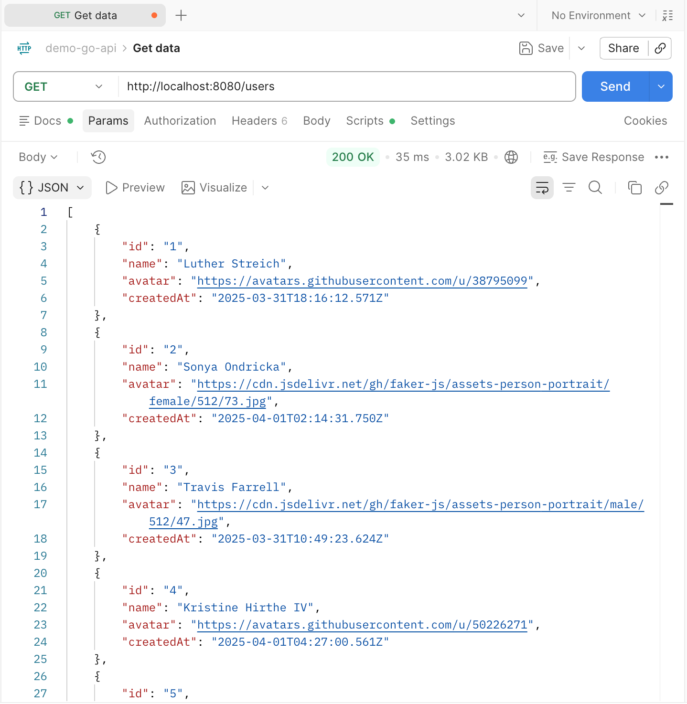
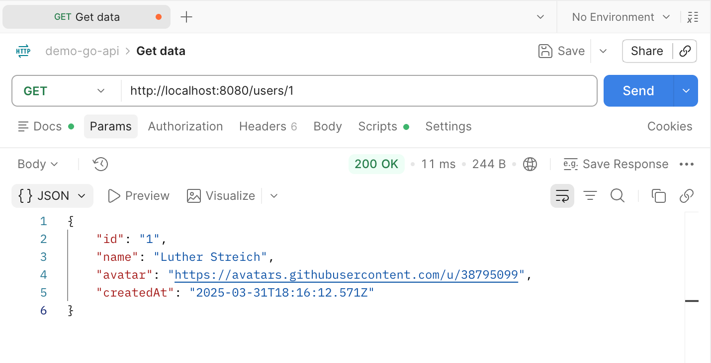

# demo-go-api

Simple REST API built with Go and Fiber. โปรเจกต์นี้เป็นตัวอย่าง backend สำหรับจัดการข้อมูล users แบบ in-memory และรองรับการรันทั้งแบบ local และ Docker.

## Features

- `GET /users` สำหรับดึง users ทั้งหมด
- `GET /users/:id` สำหรับดึง user ตาม ID
- JSON response พร้อม fields: `id`, `name`, `avatar`, `createdAt`
- Docker multi-stage build พร้อม `docker compose`

## Project Structure

```text
.
├── main.go             # Fiber app และ API routes
├── Dockerfile          # Multi-stage Docker build
├── docker-compose.yml  # Compose service configuration
├── go.mod              # Go module และ dependencies
└── README-imgs/        # Screenshots สำหรับ documentation
```

## Requirements

- Go `1.24+` สำหรับรันแบบ local
- Docker Desktop สำหรับรันด้วย container

## Run Locally

ติดตั้ง dependencies และ start server:

```bash
go mod download
go run .
```

เมื่อ server start สำเร็จ API จะพร้อมใช้งานที่ `http://localhost:8080`.

## Run with Docker Compose

Build image และ start container แบบ background:

```bash
docker compose up -d --build
```

ตรวจสอบสถานะ container:

```bash
docker compose ps
```

ดู logs:

```bash
docker compose logs -f
```

หยุดและลบ container/network:

```bash
docker compose down
```

The API is published on port `8080`:

```text
http://localhost:8080
```

## API Endpoints

### Get all users

```http
GET /users
```

Example:

```bash
curl http://localhost:8080/users
```

Response เป็น JSON array ของ users ทั้งหมด:

```json
[
	{
		"id": "1",
		"name": "Luther Streich",
		"avatar": "https://avatars.githubusercontent.com/u/38795099",
		"createdAt": "2025-03-31T18:16:12.571Z"
	}
]
```



### Get user by ID

```http
GET /users/:id
```

Example:

```bash
curl http://localhost:8080/users/1
```

เมื่อพบ user จะได้ JSON object กลับมา หากไม่พบจะตอบด้วย HTTP `404`:

```json
{
	"error": "User not found"
}
```



## Notes

ข้อมูล users ถูกประกาศไว้ใน memory ภายใน `main.go` ดังนั้นข้อมูลจะ reset ทุกครั้งที่ restart application หรือ container. This project is intended for learning and API integration demos.
